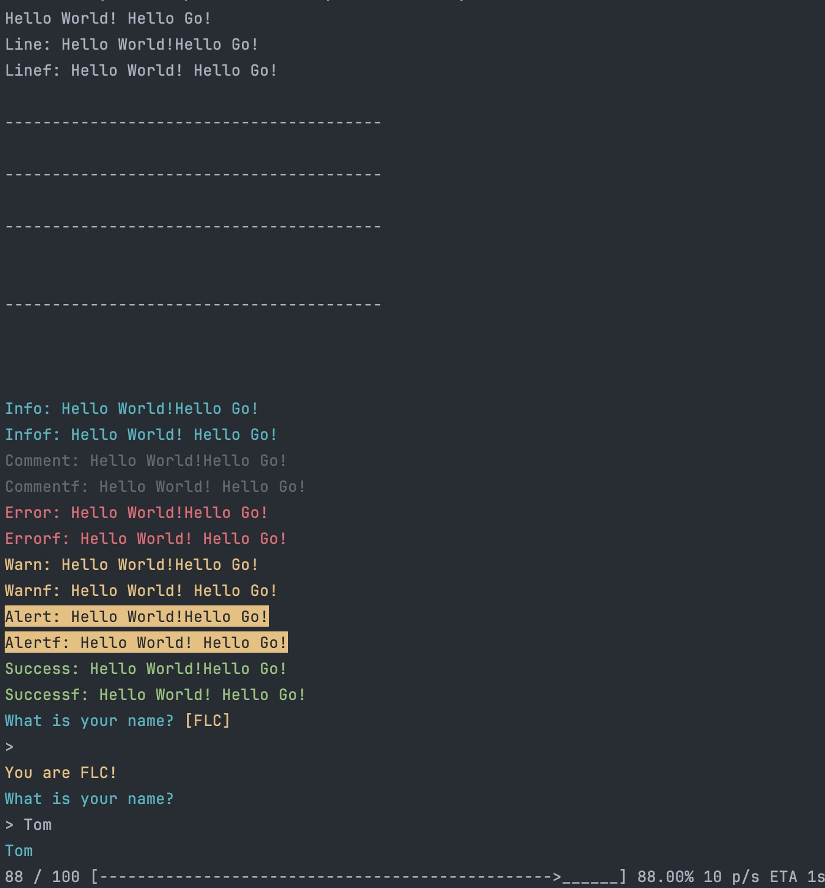

# Prints

## Usage

```go
package main

import (
	"fmt"

	"github.com/go-kratos-ecosystem/components/v2/prints"
)

func main() {
	// basic
	fmt.Println("Hello World!", "Hello Go!")
	prints.Line("Line: Hello World!", "Hello Go!")              
	prints.Linef("Linef: %s %s\n", "Hello World!", "Hello Go!") 
	prints.NewLine()                                            
	println("----------------------------------------")
	prints.NewLine(0) 
	println("----------------------------------------")
	prints.NewLine(1) 
	println("----------------------------------------")
	prints.NewLine(2) 
	println("----------------------------------------")
	prints.NewLine(3)                                                 
	prints.Info("Info: Hello World!", "Hello Go!")                    
	prints.Infof("Infof: %s %s\n", "Hello World!", "Hello Go!")       
	prints.Comment("Comment: Hello World!", "Hello Go!")              
	prints.Commentf("Commentf: %s %s\n", "Hello World!", "Hello Go!") 
	prints.Error("Error: Hello World!", "Hello Go!")                  
	prints.Errorf("Errorf: %s %s\n", "Hello World!", "Hello Go!")     
	prints.Warn("Warn: Hello World!", "Hello Go!")                    
	prints.Warnf("Warnf: %s %s\n", "Hello World!", "Hello Go!")       
	prints.Alert("Alert: Hello World!", "Hello Go!")                  
	prints.Alertf("Alertf: %s %s\n", "Hello World!", "Hello Go!")     

	// prompt
	r1, _ := prints.Ask("What is your name?", "FLC") 
	if r1 == "FLC" {
		prints.Warn("You are FLC!") 
	} else {
		prints.Infof("You are %s!\n", r1) 
	}
	r2, _ := prints.Ask("What is your name?") 
	prints.Info(r2)                           
}
```

Output:

